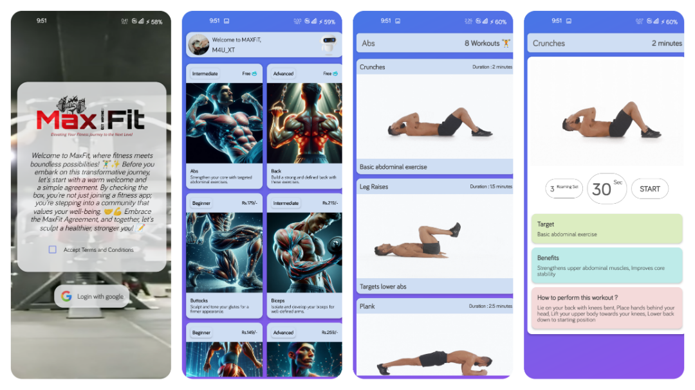
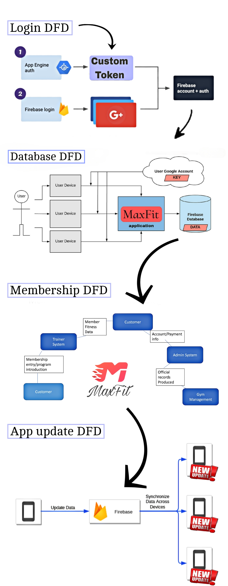

# Welcome to MaxFit Gym App

Embark on a transformative fitness journey with MaxFit, your cutting-edge gym app developed by students of Sarvajanik BCA and PGDCA College in Mehsana, Gujarat.

# App Logo


## Key Features

- **User-Friendly Interface:** Intuitive design for a seamless experience.
- **Diverse Exercise Library:** A wide range of exercises for all fitness levels.
- **Step-by-Step Guidance:** Clear instructions for effective workouts.
- **Compact and Efficient:** Powerful features in an 11MB app.

## Why Choose MaxFit?

MaxFit is more than just an app; it's a lifestyle. Join a community that thrives on inclusivity, motivation, and results.
## App Screenshots




## Technical Details

MaxFit is crafted with cutting-edge technologies, ensuring smooth performance on devices with a minimum of 512MB RAM and Android 4.1 or later. It's built with Java and developed using Android Studio for optimal functionality.

# MaxFit App Data Flow Diagram

The data flow diagram illustrates the flow of information within the MaxFit app. Here are the main components:

- **User:** Represents the app user interacting with the system.
- **Google Login:** Signifies the user authentication process using Google Firebase for a secure login experience.
- **Exercise Data:** Denotes the data related to various exercises stored in the app's database.
- **App Interface:** Represents the user interface where users interact with the app, view exercises, and perform actions.

## Data Flow

1. **User Login:**
   - The user initiates the login process by interacting with the app interface.
   - Google Login facilitates secure authentication through Firebase.

2. **Exercise Retrieval:**
   - Once logged in, the app retrieves exercise data from the database.
   - This data includes exercise names, captions, durations, steps, benefits, and image URLs.

3. **Displaying Exercises:**
   - The app interface displays the retrieved exercise data, allowing users to browse and select exercises.

4. **Performing Exercises:**
   - Users can access detailed instructions (steps) for each exercise.
   - The app guides users through the workout routine.

## Diagram


# MaxFit App Data Structure Explanation

The data structure for an exercise entry in the MaxFit app is represented as a JSON object with the following attributes:

- **name:** The name of the exercise.
- **caption:** A brief description or caption providing additional information about the exercise.
- **duration:** The time duration required to perform the exercise.
- **steps:** Step-by-step instructions detailing how to properly execute the exercise.
- **benefits:** Information about the health benefits associated with performing the exercise.
- **imgUrl:** The URL pointing to an image related to the exercise.

Example:
```json
{
  "name": "Deadlifts",
  "caption": "Compound back exercise",
  "duration": "3 minutes",
  "steps": "Stand with feet hip-width apart, Bend at the hips and knees to lower the barbell, Keep your back straight, Lift the barbell by extending your hips and knees",
  "benefits": "Targets the entire back, Strengthens lower back and hamstrings",
  "imgUrl": "https://example.com/deadlifts_image.jpg"
}
```
This structure allows for a comprehensive representation of each exercise within the MaxFit app, including essential details and visual aids.

# App Login with Google

To enhance user experience, MaxFit utilizes Google Firebase for secure and convenient app login. Users can log in seamlessly using their Google accounts, ensuring a hassle-free onboarding process.


## Development Journey

MaxFit was born through collaborative efforts within Sarvajanik BCA and PGDCA College, Mehsana, Gujarat. Developed using Android Studio, our team embraced the latest technology to bring you a state-of-the-art fitness companion. The project reached completion in March 2024, marking a significant milestone in our commitment to innovation and excellence.

## About Developers

MaxFit app is a creation of the talented developers:

- **Mahendra Gahelot (MAX):** Lead developer with a passion for creating user-friendly applications.
- **Mahir Jansari:** Frontend specialist ensuring a seamless and visually appealing user experience.
- **Jainil Panchal:** Backend genius responsible for the robust functionality of MaxFit.
## Join the Fitness Revolution

Download MaxFit today and embark on a transformative journey. Whether you aim to build strength, enhance flexibility, or simply live a healthier lifestyle, MaxFit is your companion.

[Get Started](https://github.com/mahendraplus/Max-Fit/releases/download/com.maxfit.companion_%231_1.2.apk/maxfit-v1.1.2.apk)


---

&copy; 2024 MaxFit Gym App
